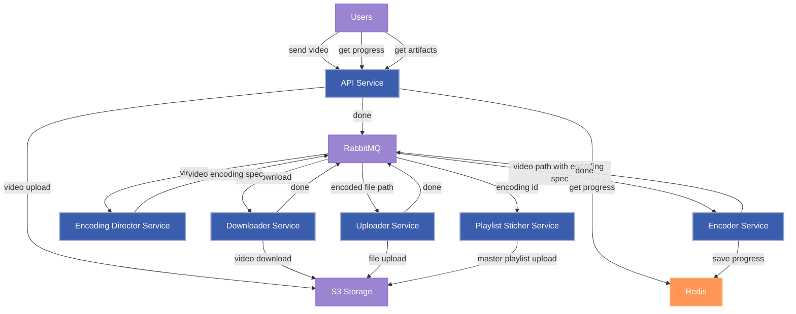
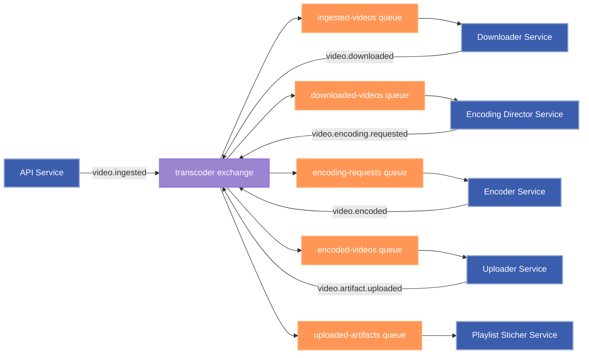

# Video transcoder service

## Architecture

## RabbitMQ Architecture

## Services

### API Service

- Accepts a video from a user by HTTP
- Uploads a video to S3
- Sends a message with video id and download to RabbitMQ
- Checks the encoding progress in Redis
- Checks the encoding artifacts in S3

### Downloader Service

- Consumes messages with video URL to download from RabbitMQ
- Downloads a video from S3 and saves it to the shared volume
- Sends a downloading done message to RabbitMQ

### Encoding Director Service

- Consumes messages with video id from RabbitMQ
- Decides the encoding profile for the video
- Sends encoding request messages to RabbitMQ (one for each encoding profile)

### Encoder Service

- Consumes messages with encoding format and video path from RabbitMQ
- Encodes a video to the desired format
- Saves the encoding progress to Redis
- Sends an encoding done message to RabbitMQ

### Uploader Service

- Consumes messages about downloading done from RabbitMQ
- Uploads encoding artifacts from shared volume to S3
- Sends an uploading done message to RabbitMQ

### Playlist Sticher Service

- Consumes messages with encoding id from RabbitMQ
- Creates a master playlist for the encoded videos
- Uploads the master playlist to S3
