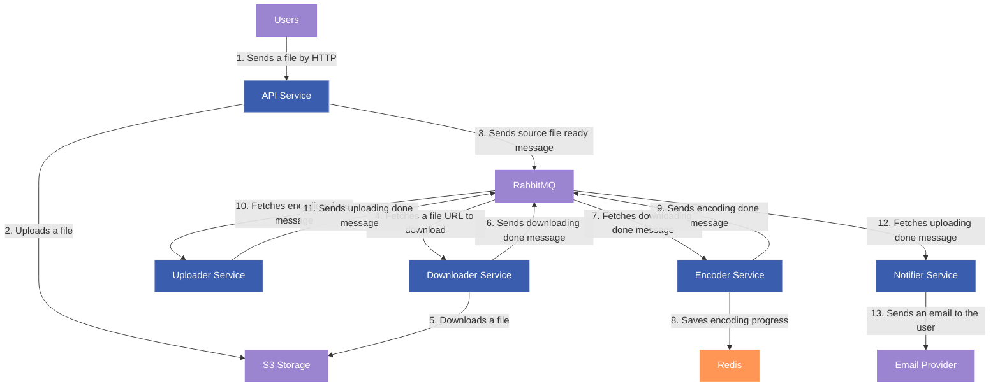

# Video transcoder service

## Architecture

## Services

### API Service

- Accepts a file from a user
- Uploads a file to S3
- Sends a message with encoding formats and file URL to RabbitMQ
- Checks the encoding progress in Redis

### Downloader Service

- Consumes messages with file URL to download from RabbitMQ
- Downloads a file from S3 and saves it to the shared volume
- Sends a downloading done message to RabbitMQ

### Encoder Service

- Consumes messages with encoding format and file URL from RabbitMQ
- Encodes a file to the desired format
- Saves the encoding progress to Redis
- Sends an encoding done message to RabbitMQ

### Uploader Service

- Consumes messages about downloading done from RabbitMQ
- Uploads encoded files from shared volume to S3
- Sends an uploading done message to RabbitMQ

### Notifier Service

- Consumes messages about uploading done from RabbitMQ
- Sends an email to the user with a download link
